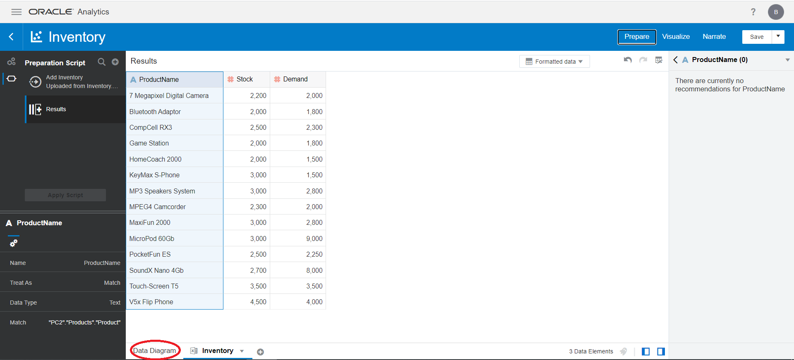
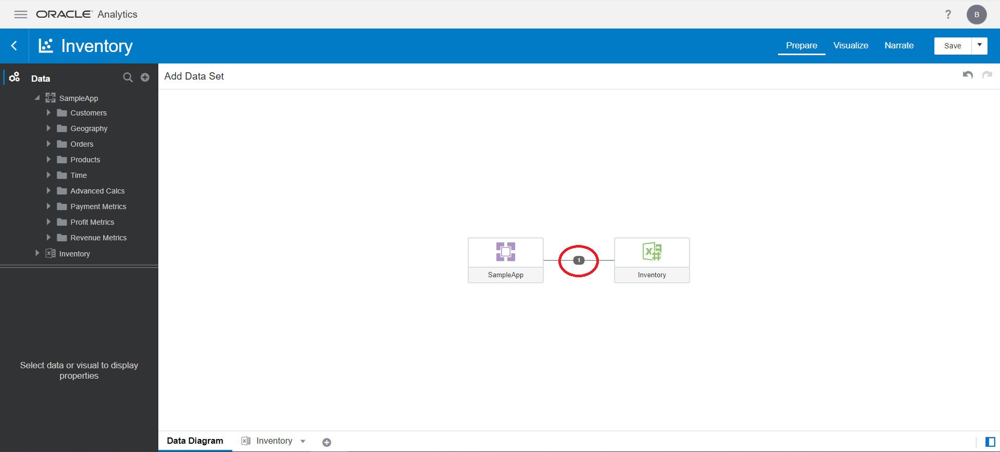
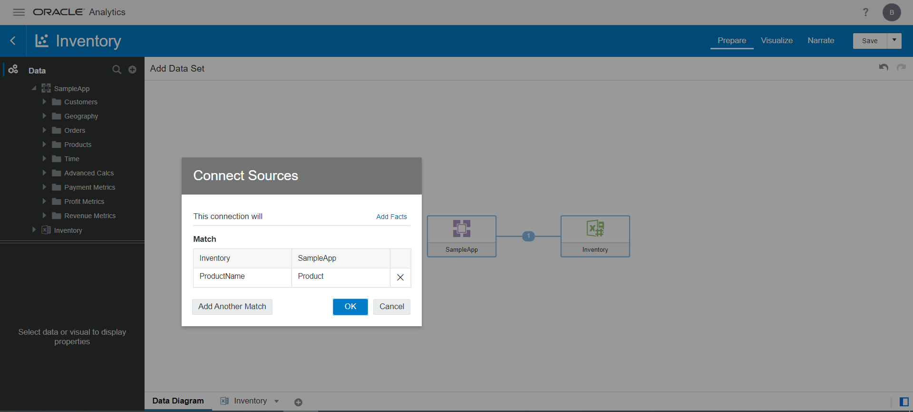
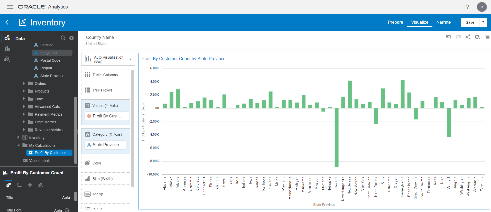
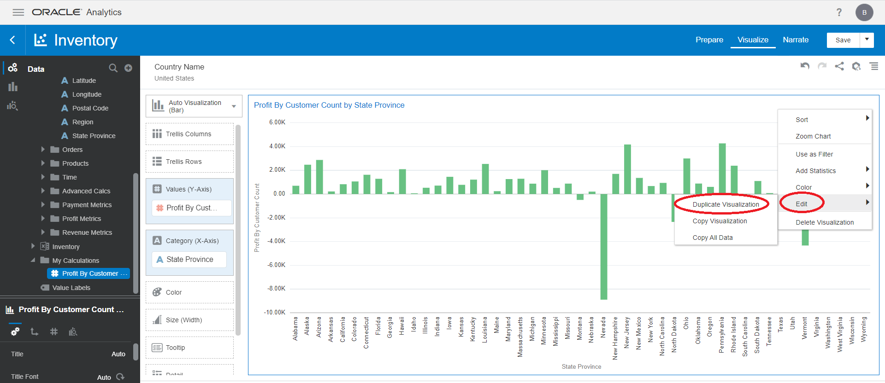
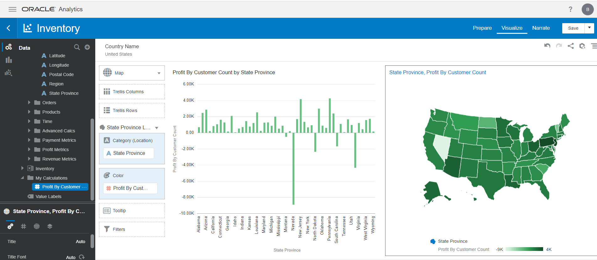
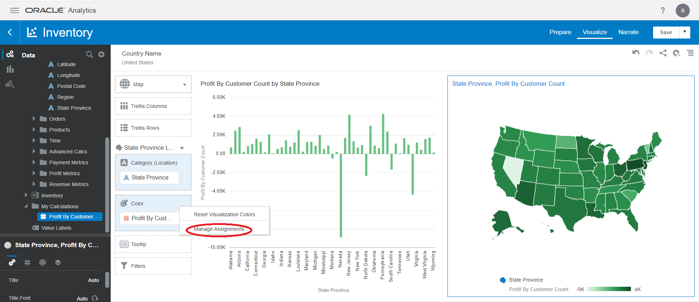
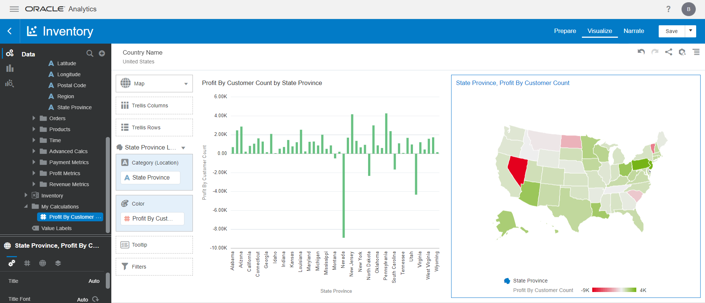

# Self-Service Data Visualization for Finance

## Introduction
This exercise will introduce you to the key features of data visualization within Oracle Analytics Server and will help to tell a story on what is happening at **JTC America Group**, a fictional conglomerate with operations in multiple geographies and segments covering a vast portfolio of products.

*Estimated Lab Time:* 30 minutes

### About Oracle Analytics Server
Oracle Analytics Server features powerful, intuitive data visualization capabilities that enable analysts to create self-service data visualizations on an accurate and consistent data set.

### Objectives

In this lab, you will explore the following features and capabilities

* Data Visualization and Mash Ups
* Custom Calculations and Maps
* Freeform Canvases, Trend Lines, and Custom Backgrounds

### Prerequisites
This lab assumes you have:
- A Free Tier, Paid or LiveLabs Oracle Cloud account
- SSH Private Key to access the host via SSH
- You have completed:
    - Lab: Generate SSH Keys (*Free-tier* and *Paid Tenants* only)
    - Lab: Prepare Setup (*Free-tier* and *Paid Tenants* only)
    - Lab: Environment Setup
    - Lab: Initialize Environment

The following files downloaded in *"Lab: Initialize Environment"* are required to complete this lab.
- inventory.xlsx
- vendor payments.xlsx
- JRC Americas Group.jpg

## **STEP 1:** Data Visualization and Mash Ups
1. From the browser session you started in *Lab: Initialize Environment*, Click on *"Create"* at the upper right-hand corner
   

2. **Click** on Project to start a new self-service project
   

3. **Select** the "Sample App" subject area and **Click** "Add to Project"
   

4. You will be presented with an empty canvas. Let’s start visualizing! First, let’s see how the product ratios are split across Product Types.

    - **Control select** "Products – Product Type" and "Profit Metrics – Profit Ratio %"
    - **Right click**, select "Pick Visualization."

   

5. **Select** "Donut" Chart
   

6. Observe the donut chart on the canvas. You can see that of all the product ratios "Audio" has the lowest profit ratio percentage.
   

7. Now, let’s try to dig deeper and find out why audio’s profit ratio is lower compared to our other product types. Let’s see how the products under "Audio" have been doing over time.

   Expand Time, Products and Profit Metrics, **CTRL-Click** *Product*, *Month* and *Profit Ratio %* Then, **drag them** to the left of Donut chart.

   A dark blue line appears.  It identifies the location of your visualization. You may drop the visualization to the left, right or top or bottom.
   

8. In order to review each product separately, **Move** "Products" to **Trellis Rows**. You should  see an individual line chart for each product as shown in the image.
   

   Since we are concerned about the profit % of the Audio product type, we will filter down to the product level. To do this, **drag** "Products - Product Type" to the filters section and select "Audio"

   Observe that "MicroPod" has declining profit ratios and "SoundX Nano" could also be improved. There could be any number of reasons why this is the case.
   

9. We believe there may be an issue with our current levels of inventory. JTC America utilizes a third-party system which captures the current stock of products and the demand. We want to mashup inventory data with our current analysis in order to derive more insights.  

   Click on "+" and "Add Data Set" to import the inventory dataset into your current project
   

10. **Click** on "Create Data Set" >> "Drop data file here or click to browse"
   

   Drag and drop, or browse and select the *“Inventory.xlsx”* file from the staging area where you unpacked the downloaded artifacts in *Lab: Initialize Environment*
   

11. Oracle Analytics Server includes its own light weight data preparation capabilities. When you import the spreadsheet, you will navigate to the preparation tab before adding the data to the project.  Here you can make some modifications to the data elements or make modifications to your data based upon any recommendations Oracle Analytics knowledge service suggests.  Additionally, you can define a relationship between the subject area – SampleApp and the inventory spreadsheet in order to join the data sources for further analysis. 

    - **Click** on the "Product Name” column.  Note the properties box in the lower left hand corner.

    The properties box provides format and configuration settings.  Settings can be modified as needed.  We are going to join our subject area – SampleApp to our inventory spreadsheet by identifying the key field.

    - Within the properties box, navigate to “match” and Click on the "None".
    

    You will see the SampleApp data source, and it’s data elements. 

    -	Select "Products -> Product" from the subject area.
    

    - **Click** "Add."
    - **Navigate** to the "Visualize" tab, where you can start playing with the data.

    

    Note:  You may also join data sources via the data diagrams tab within the prepare tab of the project. 
    
    Once you’ve added the inventory spreadsheet, notice the additional tab “data diagrams” in the bottom left of the work area. 

    

    Click “Data Diagram”.  You will see a graphical representation of the connection. 
    
    

    As you become more familiar with the features of Oracle Analytics, you will find there are often multiple ways to execute functions.  
    
    Click on the link in between SampleApp and Inventory. 
    
    You may set the connection in a similar fashion by clicking on “add another match” .

    

12. Explore the data elements panel on the left. Note the Inventory spread sheet is listed under SampleApp. Now, in order to do a mashup of the data sets, **hold control** and **select** "Product -> Product" from the subject area and "Stock" and "Demand" from the spreadsheet source.

      - **Right Click** and **Select** "Pick Visualization". Explore the data elements panel on the left.  

   

      - **Select** "Bar"

   

13. Arranging both the metrics "Stock" and "Demand" in the Y axis respectively, the graph should render as shown in the image. Looking at the bar chart, it can be easily seen that for *"MicroPod"* and *"SoundNano"*, the demand is greater than the current stock level.

   For other products, the relationship between Stock and Demand is not significantly different. We are curious why the stock levels of both products is less than the current demand.
   

14. We decide to investigate payables and receivables. In order to continue our analysis, we import our Vendor Outstanding Payment spreadsheet which we obtained from our financial system.

   **Import** the *Vendor Payments.xlsx* spreadsheet and repeat the steps from 10 and 11, including match. You should now see the data set for Vendor Payments appear in the data elements panel of the project.
   

15. Let’s create a visualization to understand which products have more outstanding vendor payments. Expand Products and Vendor Payments, **CTRL-Click** *Product* and *OutstandingPayment* Then, **Right-Click** and **select** "Pick Visualization."
   

16. Select "Tag Cloud"
   

17. You should see a new visualization on the canvas. The visual shows that **MicroPod** and **SoundX Nano** are the products with the greatest amount of outstanding vendor payments. It is quite possible that the vendors might not be willing to ship the order quantities if there substantial outstanding payments on the account.

   We must take action to clear up these payment issues.
   

18. Let’s play with a couple of options.

   On the bar chart, **right click** on the Green bar (Demand) and **Sort** -> "Product by Demand Low to High."

   See that the graph sorts itself with Demand in order from lowest to highest demand.
   

   You can filter the entire canvas by using "Keep Selected". To show this **Right Click** on the "Audio" pie slice and **select** "Keep Selected".
   

19. See that the whole canvas gets filtered for the Audio Product Type
   

20. You can clear your filter section by Right **Clicking** on the "Audio" pie slice and **selecting** "Remove Selected".
   

21. Now, let’s look at how to add custom visualizations to the canvas. Let’s start by adding a new canvas. **Click** on the "+" icon at the bottom to create a new canvas.
   

22. Expand Products and Revenue Metrics, **CTRL-Click** *Product*, *Brand*, *LOB* and *Revenue* Then, **right click** and **select** "Pick Visualization".
   

23. **Select** the "Circle Pack," which is a custom visualization.

   *Note:* if you are interested in learning how to upload custom visualization types, please see the section at the end of this document.

   **Drag** "Products" from Color to the Rows section.
   

24. The circle pack visualization appears as shown in the image. The size of the circles represents Revenue and each circle represents a combination of Brand and LOB.
   

25. Now, let’s look at revenue by date by leveraging another custom Visualization type called "Calendar Heatmap." Expand Time and Revenue Metrics, **CTRL-Click** *Date* and *Revenue* Then, **right click** and **select** the "Calendar Heatmap" visual.  
   

   Recall in the previous activity, the calendar map visualization was not available for selection. Oracle Analytics determined the calendar heatmap to be an appropriate visualization option because date and revenue were selected by the user.

   We now see a new visual appear next to the Circle Pack visual.
   

26. **Click** on the "Save" icon at the top right of the screen to save your project.
   

27. **Save** your project under  /My Folders as `"<your_name>_Project`".
   

## **STEP 2:** Custom Calculations and Maps
The data visualization capabilities in Oracle Analytics Server include mapping and custom calculations. In this exercise we will use both capabilities: we will create custom calculations based on two available metrics, and we will then display the results on a map.

1. In this exercise we will create two custom calculations and then use Oracle’s self-service built in map capabilities to analyze state and average profit per customer.

   Let’s start by adding a new canvas.

   **Click** on the "+" icon at the bottom to create a new canvas.
   

2. **Right Click** on the "My Calculations" folder.  **Select** "Add Calculation".

   Now we will create a new metric called "Profit by Customer Count".
   

3. We are going to utilize the expression builder to create the calculation.  Notice there are a wide range of functions available for creating custom calculations.

4. **Select** "Profit Value" from "Profit Metrics" and **drag** and **drop** into the calculation dialog. Type "/" after the "Profit Value" then drag and drop "# of Customers" from
"Revenue Metrics" after "/." Click Validate. Click Save.

   You have successfully created your own custom calculation that can be used like any other metric.
   

5. Let’s utilize our custom calculation in a couple of visualizations.

   Select "Country Name" from "Geography".  Drag and drop it to the top left of the canvas, right above the canvas, where it is labelled "Click here or drag data to add filter." Filter to "United States" by typing "uni" and select "United States".

   

6. Select "State Province" from "Geography" and your new custom calculation under "My Calculations." Drag and drop them onto the canvas."  Notice that not all states are making a profit. 
   

   Let’s see what this looks like on a map.

7. On the upper right corner of the visual, click the menu hamburger and select "Edit" and then "Duplicate Visualization".

   

8. Change the visualization type for the visualizations by selecting the "change visualization" menu in the upper left-hand corner of the grammar panel.

   Select map. 
   

9. Let’s change the default color scheme to a red to green gradient. From Color, click on the down arrow > Manage Assignments
   

10. Scroll to Series, and locate the calculation you created : Profit by Customer Count measure

      - **Click** the edit option (the pen) for Profit by Customer Count.
      - **Click** the Down arrow next to the color bar
      - **Select** the red to green gradient second from the bottom right.
      - **Click** "Done".

   

11. You have successfully completed custom calculations and mapping. Select "Save" to save and update your project.

   

12. Within the properties box, select the visualization options. Change the "Zoom Control" to "On".
   

13. **Click** the + on the zoom. You have successfully completed custom calculations and mapping. Select "Save" to save and update your project.
   

## **STEP 3:** Freeform Canvases, Trend Lines, and Custom Backgrounds  
Oracle self-service includes a freeform canvas mode. This allows you to place visualizations and content anywhere on the canvas. In this exercise we will use this capability to display the *"JTC Americas Group"* corporate logo as the background for trendline analysis. Advanced analytic functions such as trendline, forecast, clustering and identifying outliers are as easy as one click or a drag and drop.

1. In this exercise, we will leverage the freeform capabilities of a canvas to create a custom background. Let’s start by adding a new canvas. Click on the "+" icon at the bottom to create a new canvas. On the new canvas click the upside down triangle to the right of its name. Select "Canvas Properties".

   

2. **Click** "Auto Fit" and change it to "Freeform." **Click** "Ok"
   

3. **Select** "Profit Ratio %", "Revenue" and "Month." Pick Visualization. **Select** "Combo."

   Notice in freeform mode the entire canvas is not utilized automatically.
   

4. **Right click** "Profit Ratio %" and select "Y2 Axis." Enlarge the visualization for a better view.
    

5. **Select** the "Analytics" option from the navigation panel on the left. Drag and drop "Trend Line" onto the visualization.
   

6. You have now created a management report that shows both Revenue and Profit Ratio % with their corresponding trendlines all with no coding.

   **Drag** and **drop** "Forecast" on the visualization and you will see forecasted results for both measures. This may take a few moments, please wait.
   

   Review the properties box. Notice the forecast has predicted revenue and profit ratio % for the next 3 months. These variables may be modified as needed by the user.
   

7. Next we will add the JTC Americas logo to our canvas.
   **Click** the Visualizations menu on the left side of the pane. **Select** "Image" and **drag** and **drop** it on the canvas. Click "Select Image" and upload the *"JTC Americas Group.jpg"* file from the staging area when you unzipped the downloaded artifacts in *Lab: Initialize Environment*.

   

   

8. On the Image properties panel change the "Width" and Height" properties to "Auto Fit".
   

9. Move the image of the company logo on top of the trendline visualization. "**Right-Click** and **select** "Order Visualization"->"Send Backward".
   

10. On the Image properties panel set the "Transparency." You can **click** the value of "0" and use the slider to see how the transparency looks beneath your trendline visualization.
   

11. The result should look something like this. Select "save" to update and save your project.
   

## **STEP 4:** Uploading a custom visual extension (Read-only)  
*Note:* Tasks listed under this step are for ***reference*** only as they have already been performed on your instance

Oracle Analytics provides users choice and flexibility with deployment.  Users can upload custom visualizations and analytics scrips in order to expand and enhance self-service visualization capabilities. In this step, you will review how to leverage two of our extension options.

1. Navigate to the Analytics Library to view custom visualization plugins which are available for import

   [https://www.oracle.com/business-analytics/data-visualization/extensions.html](https://www.oracle.com/business-analytics/data-visualization/extensions.html)

   

2. Download the “Circle Pack” and “Calendar Heatmap” extensions.
   

You may now [proceed to the next lab](#next).

## Learn More
* [Oracle Analytics Server Documentation](https://docs.oracle.com/en/middleware/bi/analytics-server/index.html)
* [https://www.oracle.com/business-analytics/analytics-server.html](https://www.oracle.com/business-analytics/analytics-server.html)
* [https://www.oracle.com/business-analytics](https://www.oracle.com/business-analytics)

## Acknowledgements
* **Authors** - Diane Grace, Manager, Analytics Platform Specialist Team, NA Technology
* **Contributors** - Linda Dest, Jyotsana Rawat, Rene Fontcha
* **Last Updated By/Date** - Rene Fontcha, LiveLabs Platform Lead, NA Technology, May 2021
