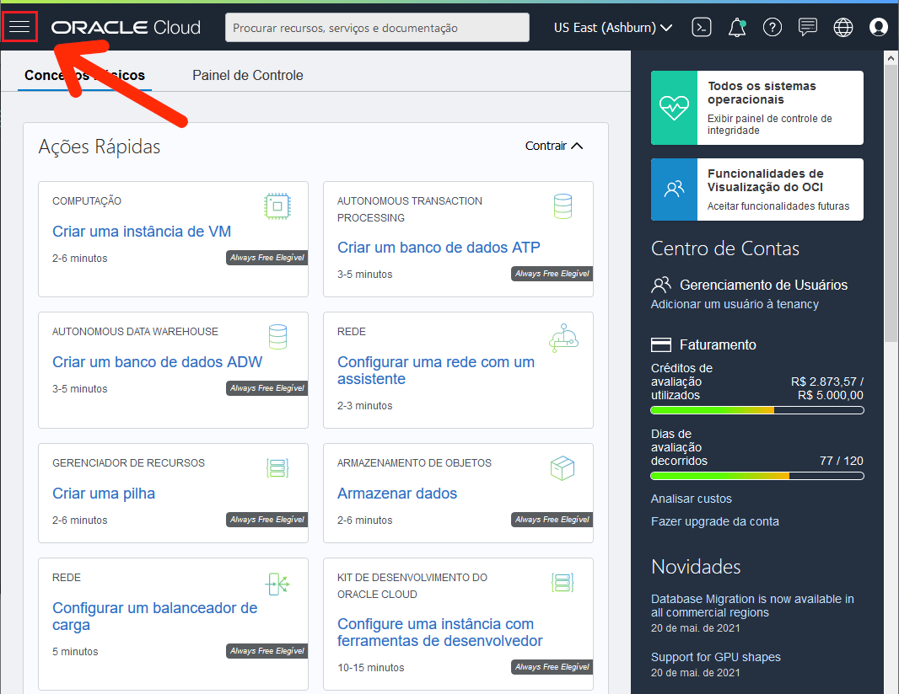
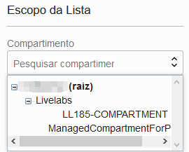
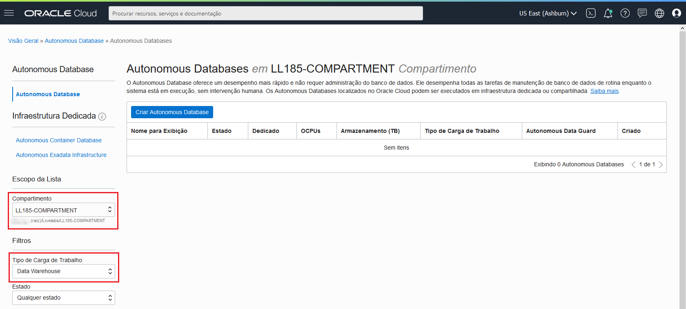
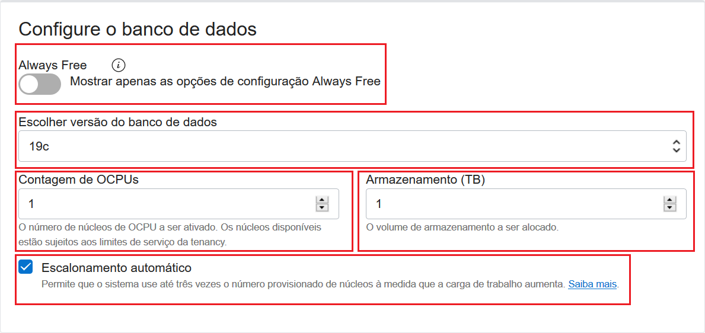
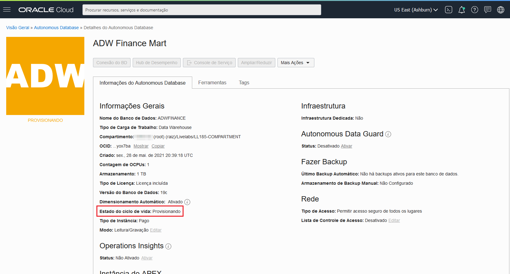

# Provisionando um Autonomous Database (ADW e ATP)

## Introdução

Este lab irá te guiar nos passos para iniciar o uso do Oracle Autonomous Database (Autonomous Data Warehouse [ADW] and Autonomous Transaction Processing [ATP]) na Oracle Cloud. Neste lab você irá provisionar uma nova instância ADW.

*Nota: Ainda que este lab utilize o ADW, os passos para a criação e conexão com uma base ATP são idênticos.*

Tempo estimado: 5 minutos

### Objetivos

-   Aprender a provisionar um Autonomous Database novo

### Pré-requisitos
- Este workshop requer uma conta na <a href="https://www.oracle.com/cloud/free/" target="\_blank">Oracle Cloud</a>. Você pode usar sua própria conta cloud, uma conta cloud que você obteve através de um trial, uma conta Modo Gratuito (Free Tier), ou uma conta de treinamento cujos detalhes foram cedidos a você por um instrutor Oracle.
- Este lab assume que você já completou os **Pré-requisitos** localizados no menu de Conteúdos à esquerda. Neste lab você irá provisionar uma instancia ADB database usando a console cloud.

## **PASSO 1**: Escolhendo ADW ou ATP pelo Menu de Serviços

1. Entre no ambiente da Oracle Cloud, conforme mostrado no lab anterior.
2. Assim que estiver conectado, você será levado ao dashboard de serviços na nuvem e poderá visualizar todos os serviços disponíveis para seu uso. Clique no menu de navegação no topo esquerdo para visualizar as opções de navegação.

    __Nota:__ Você também pode acessar o seu serviço de Autonomous Data Warehouse ou Autonomous Transaction Processing na seção __Quick Actions__ do dashboard.

    

3. Os seguintes passos se aplicam tanto para Autonomous Data Warehouse quanto Autonomous Transaction Processing. Este lab demonstra o provisionamento de uma base Autonomous Data Warehouse, então clique em **Autonomous Data Warehouse**.

    

4. Certifique-se que o tipo de carga de trabalho seja __Data Warehouse__ ou __All__ para visualizar as instâncias de Autonomous Data Warehouse. Utilize o menu __Escopo da Lista__ para selecionar um compartimento. Se você estiver usando um ambiente de LiveLabs, selecione o compartimento fornecido pelo mesmo.

    

   *Nota: Evite utilizar o compartimento ManagedCompartmentforPaaS, pois é usado pela Oracle para gerenciar os Serviços Oracle de Plataforma.*

5. Este console mostra que ainda não existem base de dados. Se houvesse uma longa lista de banco de dados, você poderia filtrá-la por **Estado** do banco de dados (Disponível, Interrompido, Encerrado, e assim por diante). Você também pode ordenar por __Tipo de Carga de Trabalho__. Aqui, o tipo __Data Warehouse__ está selecionado.

    

## **PASSO 2**: Criando uma instância ADB

1. Clique em **Criar Autonomous Database** para iniciar o processo de criação da instância.

    

2.  A tela para __Criar Autonomous Database__ vai aparecer para que você especifique as configurações da instância.
3. Forneca as informações básicas para o autonomous database:

    - __Compartimento__ - Escolha na lista um compartimento para o banco de dados.
    - __Nome para exibição__ - Digite um nome memorável para seu banco de dados ser exibido. Para este lab, use o nome __ADW Finance Mart__.
    - __Nome do banco de dados__ - Utilize apenas letras e números, iniciando com uma letra. O tamanho máximo é de 14 caracteres. (O caractere sublinhado não é suportado por hora.) Para este lab, use o nome __ADWFINANCE__ e **adicione seu user id no final**. Por exemplo, se seu user id é **LL-185**, então digite __ADWFINANCE185__

    

4. Escolha um tipo de carga de trabalho. Selecione o tipo de carga de trabalho para seu banco de dados a partir das opções:

    - __Data Warehouse__ - Para este lab, escolha __Data Warehouse__ para o tipo de carga de trabalho.
    - __Processamento de Transações__ - Opcionalmente você poderia escolher Processamento de Transações para o tipo de carga de trabalho.

    

5. Escolha um tipo de implantação. Selecione o tipo de implantação para seu banco de dados a partir das opções:

    - __Infraestrutura Compartilhada__ - Para este lab, escolha __Infraestrutura Compartilhada__ para o tipo de implantação.
    - __Infraestrutura Dedicada__ - Opcionalmente você poderia escolher Infraestrutura Dedicada para o tipo de implantação.

    

6. Configure o banco de dados:

    - __Always Free__ - Se a sua conta for de Uso Livre, você pode selecionar essa opção para criar um always free autonomous database. Um always free database possui 1 CPU e 20 GB de armazenamento. Para este lab, recomendamos deixar a opção Always Free desmarcada.
    - __Escolher versão do banco de dados__ - Selecione uma das versões disponíveis de banco de dados.
    - __Contagem de OCPUs__ - O número de núcleos de OCPU a ser ativado. Para este lab, especifique __1 CPU__. Se você escolher um banco de dados Always Free, já possuirá 1 CPU.
    - __Armazenamento (TB)__ - Escolha e volume de armazenamento a ser alocado em terabytes. Para este lab, especifique __1 TB__ de armazenamento. Senão, caso vocês escolher um banco de dados Always Free, virá com 20 GB de armazenamento.
    - __Escalonamento automático__ - Para este lab, deixe o escalonamento automático ativado para que o sistema possa automaticamente utilizar até três vezes mais núcleos provisionados a fim de suportar a carga de trabalho exigida.
    - __New Database Preview__ - Se houver uma caixa de seleção para uso antecipado de uma nova versão, NÃO a deixe marcada.

    *Nota: Não é possível escalar para mais ou menos uma Always Free autonomous database.*

    

7. Crie credenciais de administrador:

    - __Senha e Confirme a senha__ - Especifique uma senha para o usuário ADMIN da instância de serviço. A senha deve cumprir com os seguintes requerimentos:
    - A senha deve conter entre 12 e 30 caracteres, e deve incluir pelo menos uma letra maiúscula, uma minúscula e um número.
    - A senha não pode conter o nome do usuário.
    - A senha não pode conter aspas (").
    - A senha deve ser diferente das 4 últimas senhas utilizadas.
    - A senha não pode ser a mesma que já fora utilizada nas últimas 24 horas.
    - Redigite a senha para confirmá-la. Anote esta senha.

    
8. Escolher acesso à rede:
    - Para este lab, aceite o padrão "Acesso seguro de todos os lugares".
    - Se você quiser um endpoint privado, permitindo tráfego somente de uma VCN que você especificar - no qual o acesso ao banco de dados é bloqueado de IP ou VCN públicos, então selecione "Rede virtual na nuvem" na parte de Escolher acesso à rede.
    - Você pode controlar e restringir o acesso ao seu Autonomous Database por meio de listas de controle de acesso (ACL). Você pode escolher 4 modos de notação de IP: Endereço IP, Bloco CIDR, Rede Virtual na Nuvem, OCID da Rede Virtual na Nuvem.

    

9. Escolha um tipo de licença. Para este lab, selecione __(BYOL) Bring Your Own License__. Os dois tipos de licenças são:

    - __Bring Your Own License (BYOL)__ - Escolha este tipo quando sua organização já possuir licenças de banco de dados.
    - __License Included__ - Escolha este tipo quando você desejar assinar uma nova licença de software para banco de dados e o serviço de banco de dados em nuvem.

10. Clique em __Criar Autonomous Database__.

    

11.  Sua instância iniciará o provisionamento. Em poucos minutos o estado passará de Provisionando para Disponível. Nesse momento seu banco de dados Autonomous Data Warehouse está pronto para o uso! Veja alguns detalhes sobre sua instância, incluindo o nome, versão do banco de dados, contagem de OCPU e armazenamento.

    

Favor *prosseguir para o próximo lab*.

## Quer Aprender Mais?

Clique [aqui](https://docs.oracle.com/en/cloud/paas/autonomous-data-warehouse-cloud/user/autonomous-workflow.html#GUID-5780368D-6D40-475C-8DEB-DBA14BA675C3) para a documentação do fluxo de trabalho típico ao usar um Autonomous Data Warehouse.

## **Agradecimentos**

- **Author** - Nilay Panchal, ADB Product Management
- **Adapted for Cloud by** - Richard Green, Principal Developer, Database User Assistance
- **Contributors** - Oracle LiveLabs QA Team (Jeffrey Malcolm Jr, Intern | Arabella Yao, Product Manager Intern)
- **pt_BR Translated by** - André Ambrósio, May 2021
- **Last Updated By** - André Ambrósio, May 2021
