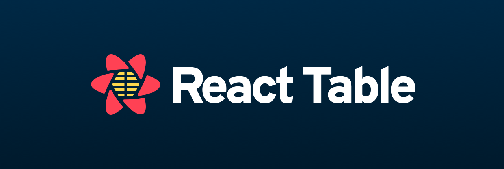
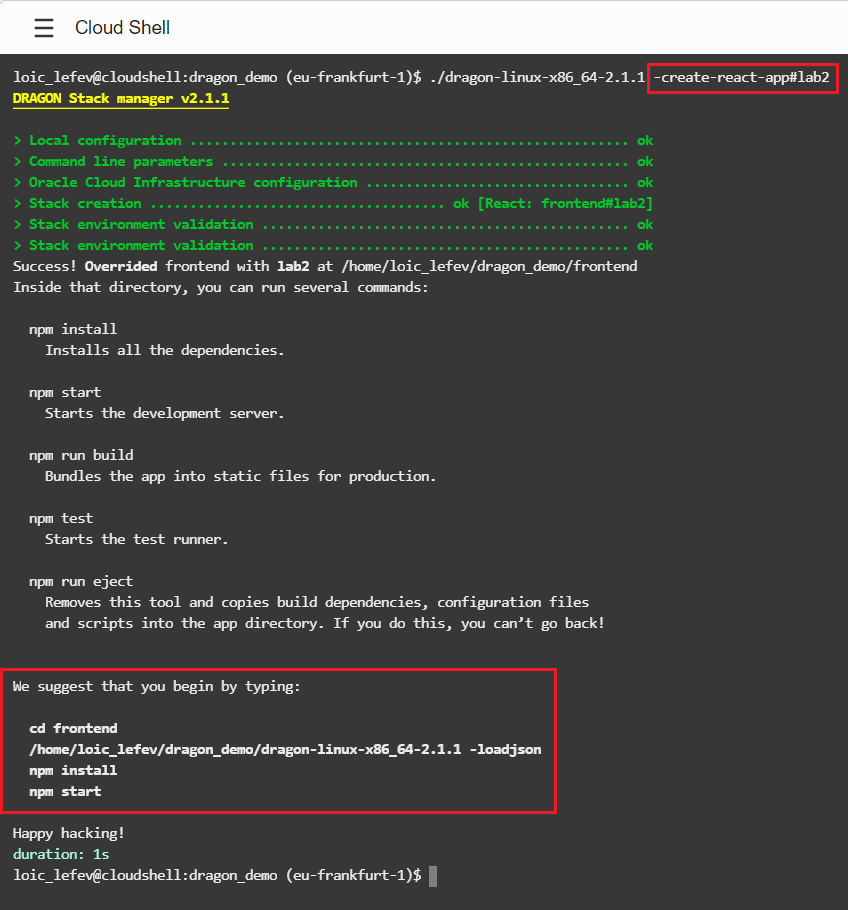
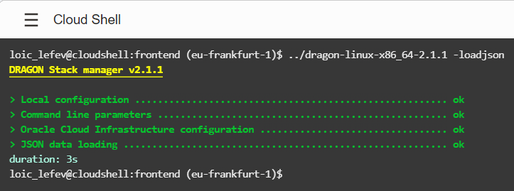
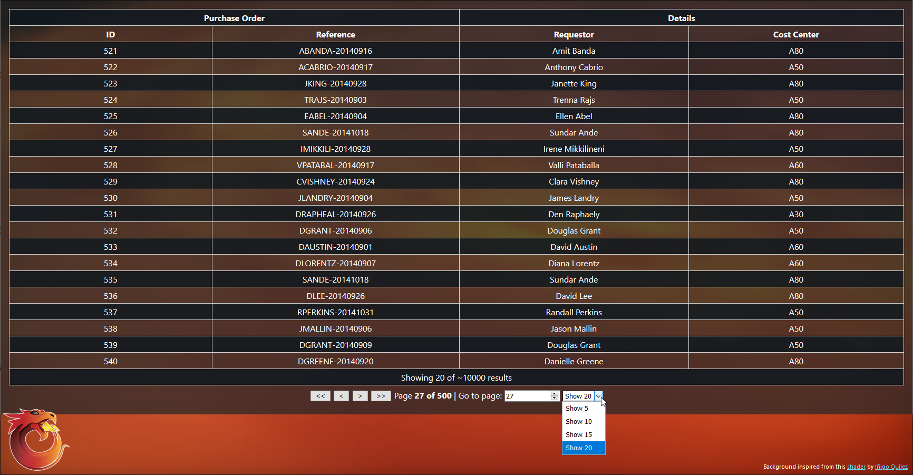
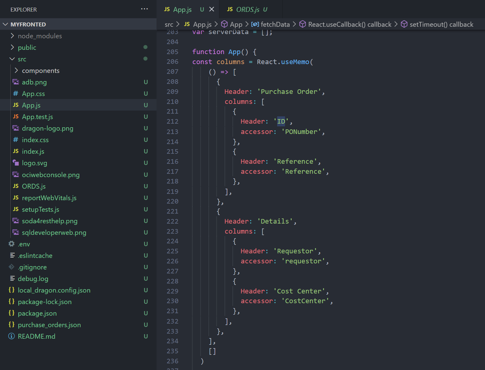

# Extend your first React Web Application using the DRAGON Stack

## Introduction

In the previous lab, you've installed the DRAGON Stack manager, provisioned an Autonomous Database and created your very first application stack: a React frontend.

In this lab, you'll extend your application using DRAGON Stack **overrides**. Indeed, while you can create basic stacks, you can also extend them with existing code samples.
Let's see how this works!

Estimated Lab Time:  10 minutes



### Prerequisites
* An Oracle Free Tier, Always Free, Paid or LiveLabs Cloud Account

## **STEP 1**: Prepare your dragon.config file

This second lab, will contain some new JSON data. These data will be loaded later into the `purchase_orders` collection.

Hence, in order to automate the loading process using DRAGON, you'll need to configure inside your `dragon.config` configuration 
file another collection to the list of managed collections:
```
<copy>
database_collections=purchase_orders
</copy>
```

Removing the Lab1 `employees` collection name will avoid loading again the same data a second time. 

## **STEP 2**: Override your existing React stack 

Overriding basic stacks is really easy, you'll need to position yourself inside the parent directory of your stack folder (default being: `frontend`) and run the following comand:
 ```
$ <copy>./dragon-linux-x86_64-2.1.1 -create-react-app#lab2</copy>
```



### Details
Running this command will modify your `frontend` folder content by downloading all the required files for this Lab.  

In details, it will:
- download the `purchase_orders.json` file that contain the data set will work with; these JSON documents will be loaded inside the `purchase_orders` collection
- download and overwrite the `package.json` file adding some new dependencies to display a nice looking [React-Table](https://react-table.tanstack.com/)
- download and overwrite the `src/App.js` file to add new code and display the JSON data (once loaded) inside a table
- download and overwrite the `src/ORDS.js` file to add a new function used to load (using pagination) the JSON data

## **STEP 3**: Run the provided commands to update the stack
Following the previous step, the DRAGON Stack manager advises for some commands to run. 

Basically, this consists of going into the frontend folder:
```
$ <copy>cd frontend</copy>
```

loading the JSON data:
```
$ <copy>./dragon-linux-x86_64-2.1.1 -loadjson</copy>
```



updating the Node.js dependencies:
```
$ <copy>npm install</copy>
```
and finally start the frontend: for OCI Cloud Shell, you may use NGROK (free version) to allow access to your frontend deployed locally.

```
wget https://bin.equinox.io/c/4VmDzA7iaHb/ngrok-stable-linux-amd64.zip

unzip ngrok-stable-linux-amd64.zip

npm start &
```

For [React](https://reactjs.org/) frontend:
```
./ngrok http 3000
``` 



## **STEP 4**: Continue by hacking this Lab

Of course this is only the beginning. You may add more JSON fields to the [React-Table](https://react-table.tanstack.com/) by working with the `src/App.js` file. 



## Learn More

* [Oracle REST Data Services](https://www.oracle.com/database/technologies/appdev/rest.html)
* [DRAGON Project (GitHub)](https://bit.ly/DRAGONStack) and add a star :)
* [React-Table portal](https://react-table.tanstack.com/)

## Acknowledgements
* **Author** - Loic Lefevre, Principal Product Manager
* **Last Updated By/Date** - Loic Lefevre, Database Product Management, June 2021


