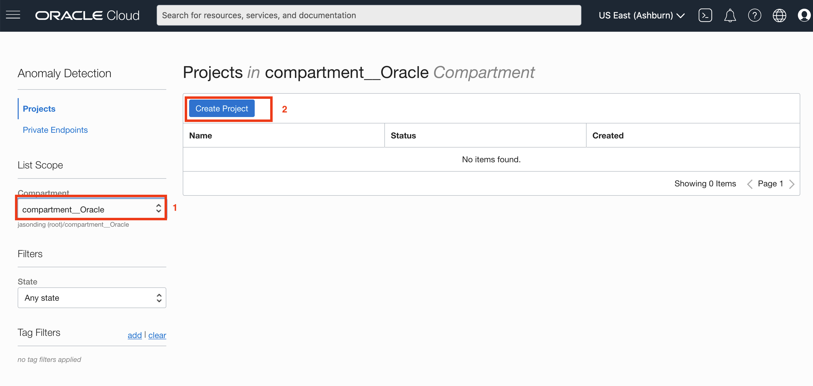
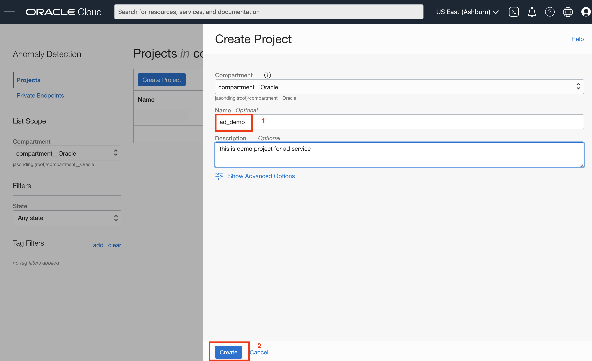
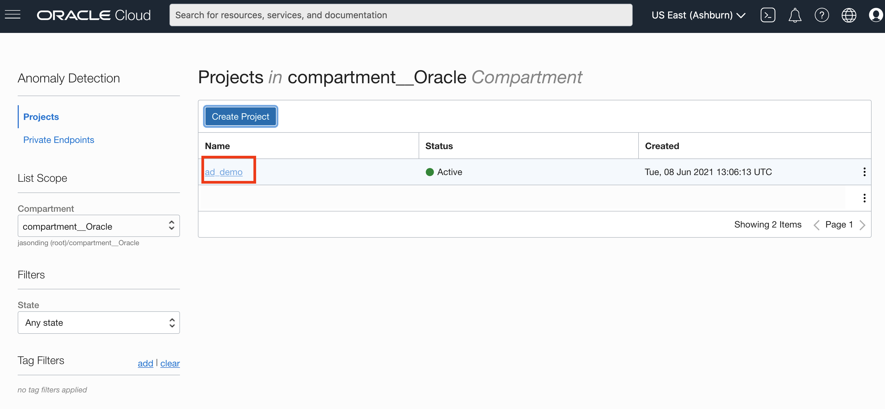
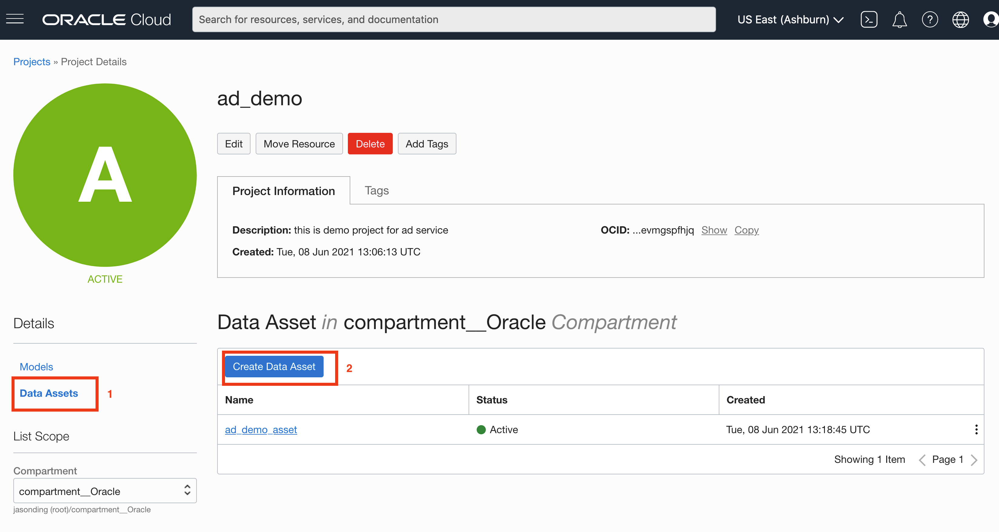

# Lab 2: Create Anomaly Detection Project

## Introduction

In this session, we will show you how to create the anomaly detection project, upload data into object storage, and create the data assets.

***Estimated Lab Time***: 15 minutes

### Objectives

In this lab, you will:
- Learn how to create an anomaly detection project
- Learn how to upload data into Oracle object storage.
- Learn how to create data asset to refer data in Oracle object storage.

### Prerequisites
- A Free tier or paid tenancy account in OCI (Oracle Cloud Infrastructure)
- Familiar with OCI object storage to upload data

## **STEP 1:** Create a Project

As mentioned, Project is a way to organize multiple data assets, models, deployments to the same workspace. It is the first step to start.

Log into OCI Cloud Console. Using the Burger Menu on the top left corner, navigate to Analytics and AI menu and click it, and then select Anomaly Detection item under AI services.

Note: Users can select any compartment where they want the AD service project to reside.

Clicking the Anomaly Detection Option will navigate one to the Anomaly Detection Console. Once here, select Create Project.

The Create Project button navigates User to a form where they can specify the compartment in which to create an Anomaly Detection Project. The project we create here is named ad_demo.

Once the details are entered click the Create Button. If the project is successfully created it will show up in projects pane. From here onwards, select ad_demo.

## **STEP 2:** Create a Data Asset

We now need to create a data asset to refer to the previously uploaded object storage.

There are two ways to create data assets, showing as follows.

### 1: Directly create new data asset

Click the Data Asset menu on the middle left, and Click the Create Data Asset button.

Then you can specify the compartment of Object storage that houses the data. Click Create Button.

After a few seconds, the data asset will be shown in the data asset main pane.

### 2: Use the Train Model button to create a new data asset (Optional)

The Create and Train Model will take user to a form with the option to either choose an existing dataset or create a new dataset. Select `Create a new data asset` radio button.

Create a new dataset navigates the User to a form, where they can specify the compartment of Object storage that houses the data. Click Create Button.

Congratulations on completing this lab!

[Proceed to the next section](#next).

## Acknowledgements
* **Authors**
    * Jason Ding - Principal Data Scientist - Oracle AI Services
    * Haad Khan - Senior Data Scientist - Oracle AI Services
* **Last Updated By/Date**
    * Haad Khan - Senior Data Scientist, May 2021
